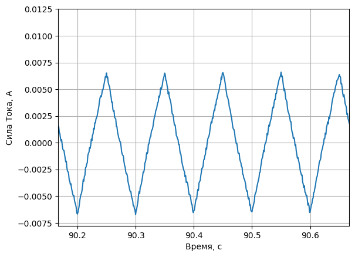
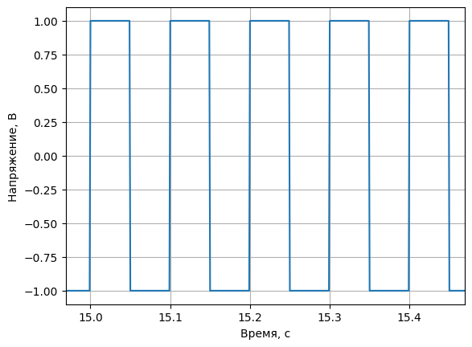

### 1. Импортировать библиотеки в Python.


```python
import numpy as np
import matplotlib.pyplot as plt
import os
import random
```

### 2. Загрузка и подготовка данных.


```python
name = random.choice(os.listdir("dataset"))
print(f"Dataset: {name}")

dataset = np.genfromtxt(f"dataset/{name}", delimiter=',')

dataset = [dataset[:, i] for i in range(dataset.shape[1])]
title = ["time", "current", "voltage"]

dataset_dict = dict(zip(title, dataset))
```

    Dataset: testLab1Var5.csv
    

### 3. Нарисовать графики тока и напряжения.

Для удобства отображения отображу не весь график, а некоторый его случайный диапазон заданного размера, установив лимиты на данные.


```python
"""
Размер интервала
"""
time_period = 0.5
```


```python
time_interval = random.random() * (dataset_dict["time"][-1] - time_period)
time_interval = (time_interval, time_interval + time_period)

print(f"Временной интервал {time_interval}")
```

    Временной интервал (14.968918705669353, 15.468918705669353)
    


```python
plt.plot(dataset_dict["time"], dataset_dict["current"])
plt.xlim(time_interval)
plt.grid()
plt.xlabel('Время, с')
plt.ylabel('Сила Тока, А')
```


    Text(0, 0.5, 'Сила Тока, А')


    

    


```python
plt.plot(dataset_dict["time"], dataset_dict["voltage"])
plt.xlim(time_interval)
plt.grid()
plt.xlabel('Время, с')
plt.ylabel('Напряжение, В')
```


    Text(0, 0.5, 'Напряжение, В')


    

    


### 4. Рассчитать значения параметров L и R.


```python
test data
```


```python

```


```python

```


```python

```
