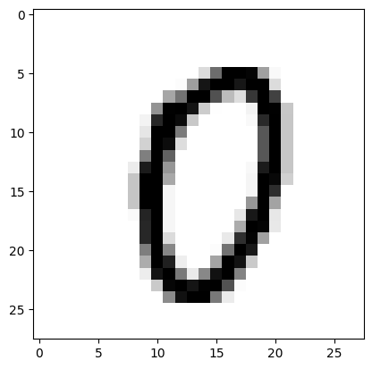

Лабораторная работа №2. Введение в проектирование нейронных сетей с помощью Python


```python
import numpy as np
import matplotlib.pyplot as plt
import os
import random
import scipy
import torch
import cv2

torch.cuda.synchronize()
torch.cuda.empty_cache()

cuda = torch.device('cuda')
print(torch.cuda.get_device_properties(cuda))
```

    _CudaDeviceProperties(name='NVIDIA GeForce RTX 3080 Laptop GPU', major=8, minor=6, total_memory=8191MB, multi_processor_count=48)
    


```python
mnist_train = np.genfromtxt(f"dataset/mnist_train.csv", delimiter=',', dtype=np.uint8)
mnist_test = np.genfromtxt(f"dataset/mnist_test.csv", delimiter=',', dtype=np.uint8)
```


```python
print(mnist_train.shape)
print(mnist_test.shape)

images_train = np.float64(np.reshape(mnist_train[:, 1:], (mnist_train.shape[0], 28, 28))) / 255
numbers_train = np.zeros((mnist_train.shape[0], 1))
images_test = np.float64(np.reshape(mnist_test[:, 1:], (mnist_test.shape[0], 28, 28))) / 255
numbers_test = np.zeros((mnist_test.shape[0], 1))

print(images_train.shape)
print(numbers_train.shape)
print(images_test.shape)
print(numbers_test.shape)


number = 4000
plt.imshow(images_train[number, :, :], cmap=plt.cm.binary, vmin=0, vmax=1)
```

    (60000, 785)
    (10000, 785)
    (60000, 28, 28)
    (60000, 1)
    (10000, 28, 28)
    (10000, 1)
    [[0.         0.         0.         0.         0.         0.
      0.         0.         0.         0.         0.         0.
      0.         0.         0.         0.         0.         0.
      0.         0.         0.         0.         0.         0.
      0.         0.         0.         0.        ]
     [0.         0.         0.         0.         0.         0.
      0.         0.         0.         0.         0.         0.
      0.         0.         0.         0.         0.         0.
      0.         0.         0.         0.         0.         0.
      0.         0.         0.         0.        ]
     [0.         0.         0.         0.         0.         0.
      0.         0.         0.         0.         0.         0.
      0.         0.         0.         0.         0.         0.
      0.         0.         0.         0.         0.         0.
      0.         0.         0.         0.        ]
     [0.         0.         0.         0.         0.         0.
      0.         0.         0.         0.         0.         0.
      0.         0.         0.         0.         0.         0.
      0.         0.         0.         0.         0.         0.
      0.         0.         0.         0.        ]
     [0.         0.         0.         0.         0.         0.
      0.         0.         0.         0.         0.         0.
      0.         0.         0.         0.         0.         0.
      0.         0.         0.         0.         0.         0.
      0.         0.         0.         0.        ]
     [0.         0.         0.         0.         0.         0.
      0.         0.         0.         0.         0.         0.
      0.         0.         0.14117647 0.57254902 0.99607843 1.
      0.98431373 0.37254902 0.02352941 0.         0.         0.
      0.         0.         0.         0.        ]
     [0.         0.         0.         0.         0.         0.
      0.         0.         0.         0.         0.         0.
      0.01176471 0.38039216 0.91764706 0.99607843 0.99607843 0.90980392
      0.99607843 0.99607843 0.1372549  0.         0.         0.
      0.         0.         0.         0.        ]
     [0.         0.         0.         0.         0.         0.
      0.         0.         0.         0.         0.         0.34901961
      0.54901961 0.99607843 0.99607843 0.68235294 0.2627451  0.12941176
      0.78431373 0.99607843 0.74509804 0.         0.         0.
      0.         0.         0.         0.        ]
     [0.         0.         0.         0.         0.         0.
      0.         0.         0.         0.         0.42352941 0.99215686
      0.99607843 0.92156863 0.2        0.00392157 0.         0.
      0.04705882 0.99607843 0.99215686 0.21960784 0.         0.
      0.         0.         0.         0.        ]
     [0.         0.         0.         0.         0.         0.
      0.         0.         0.         0.04705882 0.84705882 0.99607843
      0.95686275 0.21568627 0.         0.         0.         0.
      0.02352941 0.83529412 0.99607843 0.22352941 0.         0.
      0.         0.         0.         0.        ]
     [0.         0.         0.         0.         0.         0.
      0.         0.         0.         0.09803922 0.99607843 0.99607843
      0.51764706 0.         0.         0.         0.         0.
      0.         0.65882353 0.99607843 0.22352941 0.         0.
      0.         0.         0.         0.        ]
     [0.         0.         0.         0.         0.         0.
      0.         0.         0.         0.17647059 0.99607843 0.95294118
      0.13333333 0.         0.         0.         0.         0.
      0.         0.65882353 0.99607843 0.22352941 0.         0.
      0.         0.         0.         0.        ]
     [0.         0.         0.         0.         0.         0.
      0.         0.         0.         0.50196078 0.99607843 0.61568627
      0.         0.         0.         0.         0.         0.
      0.         0.65882353 0.99607843 0.22352941 0.         0.
      0.         0.         0.         0.        ]
     [0.         0.         0.         0.         0.         0.
      0.         0.         0.0745098  0.89411765 0.99607843 0.41176471
      0.         0.         0.         0.         0.         0.
      0.02745098 0.89411765 0.99607843 0.22352941 0.         0.
      0.         0.         0.         0.        ]
     [0.         0.         0.         0.         0.         0.
      0.         0.         0.22745098 0.99607843 0.99607843 0.34117647
      0.         0.         0.         0.         0.         0.
      0.03921569 0.99607843 0.96470588 0.18431373 0.         0.
      0.         0.         0.         0.        ]
     [0.         0.         0.         0.         0.         0.
      0.         0.         0.22745098 0.99607843 0.99607843 0.03529412
      0.         0.         0.         0.         0.         0.
      0.03921569 0.99607843 0.82352941 0.         0.         0.
      0.         0.         0.         0.        ]
     [0.         0.         0.         0.         0.         0.
      0.         0.         0.22745098 0.99607843 0.99607843 0.03529412
      0.         0.         0.         0.         0.         0.
      0.41176471 0.99607843 0.35686275 0.         0.         0.
      0.         0.         0.         0.        ]
     [0.         0.         0.         0.         0.         0.
      0.         0.         0.01960784 0.85882353 0.99607843 0.03529412
      0.         0.         0.         0.         0.         0.09411765
      0.90196078 0.99607843 0.09411765 0.         0.         0.
      0.         0.         0.         0.        ]
     [0.         0.         0.         0.         0.         0.
      0.         0.         0.         0.84705882 0.99607843 0.03529412
      0.         0.         0.         0.         0.         0.32941176
      0.99607843 0.98431373 0.09019608 0.         0.         0.
      0.         0.         0.         0.        ]
     [0.         0.         0.         0.         0.         0.
      0.         0.         0.         0.84705882 0.99607843 0.14117647
      0.         0.         0.         0.         0.08627451 0.81568627
      0.98431373 0.36862745 0.         0.         0.         0.
      0.         0.         0.         0.        ]
     [0.         0.         0.         0.         0.         0.
      0.         0.         0.         0.50588235 0.99607843 0.47058824
      0.         0.         0.         0.01176471 0.54901961 0.99607843
      0.89803922 0.         0.         0.         0.         0.
      0.         0.         0.         0.        ]
     [0.         0.         0.         0.         0.         0.
      0.         0.         0.         0.3254902  0.99607843 0.87058824
      0.06666667 0.         0.         0.35686275 0.99607843 0.9254902
      0.20784314 0.         0.         0.         0.         0.
      0.         0.         0.         0.        ]
     [0.         0.         0.         0.         0.         0.
      0.         0.         0.         0.07058824 0.92156863 0.99607843
      0.5254902  0.08235294 0.46666667 0.92941176 0.99607843 0.48627451
      0.         0.         0.         0.         0.         0.
      0.         0.         0.         0.        ]
     [0.         0.         0.         0.         0.         0.
      0.         0.         0.         0.         0.20784314 0.97647059
      0.99607843 0.91764706 0.98823529 0.99607843 0.6745098  0.01176471
      0.         0.         0.         0.         0.         0.
      0.         0.         0.         0.        ]
     [0.         0.         0.         0.         0.         0.
      0.         0.         0.         0.         0.         0.45490196
      0.92941176 0.99607843 0.99607843 0.52156863 0.07843137 0.
      0.         0.         0.         0.         0.         0.
      0.         0.         0.         0.        ]
     [0.         0.         0.         0.         0.         0.
      0.         0.         0.         0.         0.         0.
      0.         0.         0.         0.         0.         0.
      0.         0.         0.         0.         0.         0.
      0.         0.         0.         0.        ]
     [0.         0.         0.         0.         0.         0.
      0.         0.         0.         0.         0.         0.
      0.         0.         0.         0.         0.         0.
      0.         0.         0.         0.         0.         0.
      0.         0.         0.         0.        ]
     [0.         0.         0.         0.         0.         0.
      0.         0.         0.         0.         0.         0.
      0.         0.         0.         0.         0.         0.
      0.         0.         0.         0.         0.         0.
      0.         0.         0.         0.        ]]
    


    <matplotlib.image.AxesImage at 0x1bf1efa4190>


    

    


```python

```


```python
mnist_train[:, 0]
```
