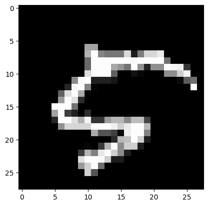

Лабораторная работа №2. Введение в проектирование нейронных сетей с помощью Python

Одна из задач киберфизических систем - распознавание изображений с помощью машинного зрения. В этой лабораторной работе мы рассмотрим решение проблемы такого типа.

Мы будем использовать два файла данных с массивом рукописных чисел: mnist_train.csv и mnist_test.csv. Первый файл необходимо использовать для обучения нейронной сети, второй файл необходимо использовать для проверки работы нейронной сети. Каждый файл содержит строки (60000 в первом файле и 10000 во втором файле), в каждой из которых хранится массив размером 28x28 пикселей с цифровым изображением и номером, который соответствует изображению.

Основная задача - спроектировать нейронную сеть на Python, способную распознавать изображения чисел.

###  1 Импортировать библиотеки в Python.

Сначала идёт условный список полезных источников, потом импортируются пакеты для работы с данными и, гвоздь программы, pytorch.

Затем в pytorch выставляется режим повышенной производительности, и проверяется, какие способы вычисления дам доступны. TensorRT сам по себе установился на данную операционную систему Windows 10, но работать через pytorch с ним официально можно только на ubuntu, так что RT Ядра моей RTX3080 сегодня просто отдыхают... Пока.

Выставляется устройство по-умолчанию - cuda, и мы готовы к работе


```python
"""
https://github.com/vedaant-varshney/ImageClassifierCNN/blob/master/Image%20Classifier.ipynb

https://vitalflux.com/different-types-of-cnn-architectures-explained-examples

https://sahiltinky94.medium.com/know-about-googlenet-and-implementation-using-pytorch-92f827d675db
"""

from IPython.display import clear_output
import pandas as pd
import numpy as np
import matplotlib.pyplot as plt
import os
import random
import scipy
import torch
import torch.nn as nn
import torch.nn.functional as F
import gc
import torch.backends.cudnn

num_workers = 0
batch_size = 100
valid_size = 0.2
learning_rate = 0.01
learning_momentum = 0.9
MODEL_NAME = "LeNet"

torch.cuda.synchronize()
torch.cuda.empty_cache()
gc.collect()

torch.use_deterministic_algorithms(False)
torch.backends.cudnn.benchmark = True

print("Is cuda available?", torch.cuda.is_available())
print("Is cuDNN version:", torch.backends.cudnn.version())
print("cuDNN enabled? ", torch.backends.cudnn.enabled)
print("cuDNN benchmark?", torch.backends.cudnn.benchmark)
print("is Use Deterministic Algorithms?", torch.backends.cudnn.deterministic)

cuda = torch.device('cuda')
print(torch.cuda.get_device_properties(cuda))
```

    Is cuda available? True
    Is cuDNN version: 8302
    cuDNN enabled?  True
    cuDNN benchmark? True
    is Use Deterministic Algorithms? False
    _CudaDeviceProperties(name='NVIDIA GeForce RTX 3080 Laptop GPU', major=8, minor=6, total_memory=8191MB, multi_processor_count=48)
    

###  2 Считывание исходных данных и отправка в память GPU

Для ускорения работы буду считывать через pandas с движком на **C**. Можно быстрее, но не из формата csv.


```python
# mnist_train = np.genfromtxt(f"dataset/mnist_train.csv", delimiter=',', dtype=np.uint8)
# mnist_test = np.genfromtxt(f"dataset/mnist_test.csv", delimiter=',', dtype=np.uint8)

mnist_train = pd.read_csv(f"dataset/mnist_train.csv", header=None, engine="c", delimiter=',', dtype=np.uint8).to_numpy()
mnist_test = pd.read_csv(f"dataset/mnist_test.csv", header=None, engine="c", delimiter=',', dtype=np.uint8).to_numpy()
```

Размер датасета можно узнать методом shape у матриц numpy.

Для загрузки данных в нейронную сеть pytorch их нужно преобразовать в тензор, а, чтобы вычислять что-то на видеокарте, загрузить данные в память видеокарты.


```python
print(mnist_train.shape)
print(mnist_test.shape)

images_train = np.float32(np.reshape(mnist_train[:, 1:], (mnist_train.shape[0], 28, 28, 1))) / 255
numbers_train = mnist_train[:, 0]
images_test = np.float32(np.reshape(mnist_test[:, 1:], (mnist_test.shape[0], 28, 28, 1))) / 255
numbers_test = mnist_test[:, 0]

images_train = np.transpose(images_train, [0, 3, 1, 2])
images_test = np.transpose(images_test, [0, 3, 1, 2])

images_train = torch.tensor(images_train, device=cuda).to(non_blocking=True)
numbers_train = torch.tensor(numbers_train, device=cuda).to(non_blocking=True)
images_test = torch.tensor(images_test, device=cuda).to(non_blocking=True)
numbers_test = torch.tensor(numbers_test, device=cuda).to(non_blocking=True)

print(images_train.shape)
print(numbers_train.shape)
print(images_test.shape)
print(numbers_test.shape)

print("Классы: ", np.unique(numbers_train.cpu()))
```

    (60000, 785)
    (10000, 785)
    torch.Size([60000, 1, 28, 28])
    torch.Size([60000])
    torch.Size([10000, 1, 28, 28])
    torch.Size([10000])
    Классы:  [0 1 2 3 4 5 6 7 8 9]
    

Пример числа из обучающего датасета


```python
number_train = random.randint(0, images_test.cpu().shape[0])
plt.imshow(images_test.cpu()[number_train, 0, :, :], cmap=plt.cm.binary, vmin=0, vmax=1)
plt.title(f"Число из обучающего датасета: {numbers_test.cpu().numpy()[number_train]}")
print()
```

    
    


    

    


Пример числа из тестового датасета


```python
number_test = random.randint(0, images_test.cpu().shape[0])
plt.imshow(images_test.cpu()[number_test, 0, :, :], cmap=plt.cm.binary, vmin=0, vmax=1)
plt.title(f"Число из тестового датасета: {numbers_test.cpu().numpy()[number_test]}")
print()
```

    
    


    

    


Итоговый размер датасета


```python
print(images_train.shape)
print(numbers_train.shape)
```

    torch.Size([60000, 1, 28, 28])
    torch.Size([60000])
    

###  3 Подготовка датасетов для обучения

Для обучения будут существовать 3 выборки:
- Обучающая
- Проверочная
- Тестовая

Обучающая - самое простое - основная выборка, на которой будет обучаться наша нейронная сеть.

Проверочная - интересная идея - выборка, на которой оценивается точность выполнения нейронки в процессе её обучения, для сохранения весов в файл в тот момент, когда значение ошибки на Проверочной выборке было минимальным.

Тестовая - старая идея - выборка, на которой проверяется итоговая обученная нейронная сеть, чтобы выдать некоторые метрики точности своей работы.

Перед подачей на нейронную сеть данные нужно изменить в размере до рассчитанного входа нейронной сети и нормировать, это делается последовательностью операций **normalize_transforms**.

Также, для разнообразия данных уже в самом дадасете, к исходным изображениям применяется случайный поворот от -25 до 25 градусов, а также инверсия цветов с вероятностью 50%. Это нужно, чтобы распознавать как белые числа на чёрном фоне, так и чёрные числа на белом фоне. Данные операции хранятся в последовательности **train_transforms**

DataLoader нужен, чтобы создавать выборки (так называемые батчи) из датасета заданного размера **batch_size** случайным образом.


```python
from torchvision import datasets
import torchvision.transforms as transforms
from torch.utils.data.sampler import SubsetRandomSampler
from torch.utils.data import TensorDataset, DataLoader

from importlib import reload
import LeNet

reload(LeNet)

# Picking Fashion-MNIST dataset

train_transforms = transforms.Compose([
    transforms.RandomRotation(25),
    transforms.RandomInvert(p=0.5),
])
# transforms.RandomInvert(p=0.5),
normalize_transforms = transforms.Compose([
    transforms.Resize(size=LeNet.IMAGE_SIZE, interpolation=transforms.InterpolationMode.BICUBIC),
    transforms.Normalize((0.5,), (0.5,)),
])
# transforms.Normalize((0.5,), (0.5,)),

train_data = TensorDataset(images_train, numbers_train)
test_data = TensorDataset(images_test, numbers_test)

# Finding indices for validation set
num_train = len(train_data)
indices = list(range(num_train))
#Randomize indices
np.random.shuffle(indices)

split = int(np.floor(num_train * valid_size))
train_index, test_index = indices[split:], indices[:split]

# Making samplers for training and validation batches
train_sampler = SubsetRandomSampler(train_index)
valid_sampler = SubsetRandomSampler(test_index)

# Creating data loaders
train_loader = torch.utils.data.DataLoader(train_data, batch_size=batch_size, sampler=train_sampler,
                                           num_workers=num_workers)
valid_loader = torch.utils.data.DataLoader(train_data, batch_size=batch_size, sampler=valid_sampler,
                                           num_workers=num_workers)
test_loader = torch.utils.data.DataLoader(test_data, batch_size=batch_size, num_workers=num_workers)

# Image classes
classes = ['0', '1', '2', '3', '4', '5', '6', '7', '8', '9']
```

Хороший пример изображения, которое будет подано для обучения нейронной сети:


```python
for batch_index, (data, target) in enumerate(train_loader):
    break

image = normalize_transforms(train_transforms(data.cpu()))
image_index = random.randint(0, image.shape[0])

print(data.shape, target.shape, classes[target[image_index]])
plt.imshow(image[image_index, 0, :, :], cmap=plt.cm.binary, vmin=-1, vmax=1)
```

    torch.Size([100, 1, 28, 28]) torch.Size([100]) 5
    


    <matplotlib.image.AxesImage at 0x1ebbdd9dc00>


    

    


###  4 Создание модели

Модель любой нейронной сети в pytorch создаётся элементарно и состоит из 2 компонентов:
1. Архитектуры нейронной сети
2. Весов всех слоёв нейронной сети

Открытые популярные архитектуры можно загрузить прямо из библиотеки, как и публичные веса слоёв, но если мы далем свою нейронную сеть, необходимо хранить модель в виде файла с её [классом питона](./LeNet.py)

Веса же, как потом будет показано, можно сохранить и загрузить из файла.

В качестве "loss function" (или функции потерь / целевой функции) будет выбрана КроссЭнтропия, а в качестве оптимизатора SGD (Стохастический Градиентный Спуск). Его можно рассматривать как стохастическую аппроксимацию оптимизации градиентного спуска, поскольку он заменяет фактический градиент (рассчитанный на основе всего набора данных) его оценкой (рассчитанной на основе случайно выбранного подмножества данных). Особенно в многомерных задачах оптимизации это снижает очень высокую вычислительную нагрузку, добиваясь более быстрых итераций в торговле для более низкой скорости сходимости.


```python
from importlib import reload
import torchvision.models
import LeNet
import torch.optim as optim

reload(LeNet)

model = LeNet.LeNet()
model.cuda()
print(model)

# loss function (cross entropy loss)
criterion = nn.CrossEntropyLoss()

train_losses = []
valid_losses = []

# tracks validation loss change after each epoch
minimum_validation_loss = np.inf

# optimizer
optimizer = optim.SGD(model.parameters(), lr=learning_rate, momentum=learning_momentum)
```

    LeNet(
      (conv): Sequential(
        (0): Conv2d(1, 6, kernel_size=(5, 5), stride=(1, 1), padding=(2, 2))
        (1): Sigmoid()
        (2): AvgPool2d(kernel_size=(2, 2), stride=2, padding=0)
        (3): Conv2d(6, 16, kernel_size=(5, 5), stride=(1, 1))
        (4): Sigmoid()
        (5): AvgPool2d(kernel_size=(2, 2), stride=2, padding=0)
      )
      (fc): Sequential(
        (0): Linear(in_features=400, out_features=120, bias=True)
        (1): Sigmoid()
        (2): Linear(in_features=120, out_features=84, bias=True)
        (3): Sigmoid()
        (4): Linear(in_features=84, out_features=10, bias=True)
      )
    )
    

###  5 Обучение модели

В epochs выставляется число Эпох данного захода. Код ниже выполняется дольше всего, так что он написан так, чтобы его можно было останавливать в любой момент. Прогресс сохранится в кэше ipynb. На данном этапе происходит обучение нейронной сети.
1. Сначала модель переключается в режим обучения, затем на всех случайных выборках батчей из датасета модель обучается и обновляет свои веса, для всех батчей обучающей выборки считается loss function
2. Потом модель переключается в режим выполнения, и считается loss function от проверочной выборки
3. Если loss function от проверочной выборки уменьшилась, по сравнению с некоторым её прошлым минимумом, обновляем минимум и сохраняем веса слоёв нейронов в файл.

В реальном времени можно наблюдать за качеством обучения нейронной сети: "Training loss" и "Validation loss" показывают, как идёт прогресс обучения.
Когда "Training loss" станет заметно ниже "Validation loss", модель переобучится (вызубрит наш датасет, и будет хуже работать на реальных данных), но пункт 3 из алгоритма выше сохранит веса до этого момента.


```python
# epochs to train for
epochs = 1

for epoch in range(1, epochs + 1):
    clear_output(wait=True)

    train_loss = 0
    valid_loss = 0

    # training steps
    model.train()

    index = 0
    for batch_index, (data, target) in enumerate(train_loader):
        index += 1
        # clears gradients
        optimizer.zero_grad()
        # forward pass
        output = model(normalize_transforms(train_transforms(data)))
        # loss in batch
        loss = criterion(output, target)
        # backward pass for loss gradient
        loss.backward()
        # update paremeters
        optimizer.step()
        # update training loss
        train_loss += loss.item() * data.size(0)

    # validation steps
    model.eval()
    for batch_index, (data, target) in enumerate(valid_loader):
        # forward pass
        output = model(normalize_transforms(train_transforms(data)))
        # loss in batch
        loss = criterion(output, target)
        # update validation loss
        valid_loss += loss.item() * data.size(0)

    # average loss calculations
    train_loss = train_loss / len(train_loader.sampler)
    valid_loss = valid_loss / len(valid_loader.sampler)
    train_losses.append(train_loss)
    valid_losses.append(valid_loss)

    # Display loss statistics
    print(
        f'Текущая Эпоха: {len(train_losses)}\nTraining Loss: {round(train_loss, 6)}\nValidation Loss: {round(valid_loss, 6)}')

    # Saving model every time validation loss decreases
    if valid_loss <= minimum_validation_loss:
        print(f'Validation loss уменьшилась с {round(minimum_validation_loss, 6)} до {round(valid_loss, 6)}')
        torch.save(model.state_dict(), f'{MODEL_NAME}.pt')
        minimum_validation_loss = valid_loss
        print('Сохранение новой модели')

    plt.plot(train_losses, 'g')
    plt.plot(valid_losses, 'r')
    plt.ylim([0, max(np.max(np.array(train_losses)), np.max(np.array(train_losses)), 0.0) * 1.1])
    plt.xlabel("Эпоха")
    plt.ylabel("Точность")
    plt.legend(["Training loss", "Validation loss"])
    plt.show()
```

    Текущая Эпоха: 940
    Training Loss: 0.03266
    Validation Loss: 0.052915
    


    

    


###  6 Тестирование точности модели

В куске кода ниже создаётся новый объект модели, и в него загружаются веса из файла.


```python
from importlib import reload
import LeNet

reload(LeNet)

model_new = LeNet.LeNet()
model_new.cuda()
model_new.load_state_dict(torch.load(f'{MODEL_NAME}.pt'))

output_max = None
output_min = None
```

В качестве оценки итоговой точности работы нейронной сети выбран древний алгоритм Accuracy, равный отношению правильно распознанных классов к общему их количеству.


```python
# tracking test loss
test_loss = 0.0
class_correct = list(0. for i in range(10))
class_total = list(0. for i in range(10))

model_new.eval()

for batch_idx, (data, target) in enumerate(test_loader):
    # forward pass
    output = model_new(normalize_transforms(train_transforms(data)))

    local_max = np.max(output.detach().cpu().numpy(), axis=0)
    local_min = np.min(output.detach().cpu().numpy(), axis=0)
    if output_max is None:
        output_max = local_max
    else:
        output_max = np.max(np.array([local_max, output_max]), axis=0)
    if output_min is None:
        output_min = local_min
    else:
        output_min = np.min(np.array([local_min, output_min]), axis=0)

    # batch loss
    loss = criterion(output, target)
    # test loss update
    test_loss += loss.item() * data.size(0)
    # convert output probabilities to predicted class
    _, pred = torch.max(output, 1)
    # compare predictions to true label
    correct_tensor = pred.eq(target.data.view_as(pred))
    correct = np.squeeze(correct_tensor.numpy()) if not torch.cuda.is_available() else np.squeeze(
        correct_tensor.cpu().numpy())
    # calculate test accuracy for each object class
    for i in range(len(target.data)):
        label = target.data[i]
        class_correct[label] += correct[i].item()
        class_total[label] += 1

# average test loss
test_loss = test_loss / len(test_loader.dataset)
print(f'Итоговое значение функции потерь: {round(test_loss, 6)}')

for i in range(10):
    if class_total[i] > 0:
        print(f'Тест Точность класса {classes[i]}: {round(100 * class_correct[i] / class_total[i], 2)}%')
    else:
        print(f'Тест Точность класса {classes[i]}s: N/A (нет обучающих примеров)')

print(
    f'Полная Тест Точность: {round(100. * np.sum(class_correct) / np.sum(class_total), 2)}% {np.sum(class_correct)} распознано из {np.sum(class_total)}')

output_max = np.array(output_max)
output_min = np.array(output_min)
print(f"output_min = {output_min}\noutput_max = {output_max}")
```

    torch.Size([100, 16, 5, 5])
    Итоговое значение функции потерь: 0.041462
    Тест Точность класса 0: 99.18%
    Тест Точность класса 1: 99.65%
    Тест Точность класса 2: 98.74%
    Тест Точность класса 3: 98.51%
    Тест Точность класса 4: 98.98%
    Тест Точность класса 5: 99.1%
    Тест Точность класса 6: 98.96%
    Тест Точность класса 7: 98.74%
    Тест Точность класса 8: 98.15%
    Тест Точность класса 9: 97.32%
    Полная Тест Точность: 98.74% 9874.0 распознано из 10000.0
    output_min = [-11.627637 -10.838976 -13.527867 -11.374372 -11.031287 -11.646321
     -18.177319 -13.042169  -7.198384 -10.43318 ]
    output_max = [12.371775 16.53599  19.350252 19.31704  18.376463 18.89376  17.277874
     16.910206 17.962189 17.207548]
    

###  7 Модификация: Уверенность в результате

Далее попытаюсь улучшить работу нейронной сети, дав ей возможность сомневаться в своём решении, если на соответствующем максимальному весу выходе не достаточно высокий сигнал.


```python
prediction_threshold_amount = 1000
```

Сначала делом узнаю нормированное значение сигнала на выходе, когда нейронная сеть ошибается.


```python
prediction_threshold_low = []

while len(prediction_threshold_low) < prediction_threshold_amount:
    for batch_idx, (data, target) in enumerate(train_loader):
        clear_output(wait=True)
        data = normalize_transforms(train_transforms(data))
        output = model_new(data[:1, :1, :, :]).cpu().detach()
        output = np.divide(output.numpy()[0] - output_min, output_max - output_min)
        if target[0] == np.argmax(output):
            continue
        prediction_threshold_low.append(np.max(output))
        print(
            f"calibration lower threshold {100 * len(prediction_threshold_low) / prediction_threshold_amount:.2f}%")
        print(f"real value = {target[0]}")
        print(f"prediction = {np.argmax(output)}")
        print(f"prediction % = {np.max(output)}")
        print(f"predictions = {output}")
        plt.imshow(data.cpu()[0, 0, :, :], cmap=plt.cm.binary, vmin=-1, vmax=1)
        plt.show()
        if len(prediction_threshold_low) >= prediction_threshold_amount:
            break

threshold_low = np.mean(np.array(prediction_threshold_low))
threshold_low_std = np.std(np.array(prediction_threshold_low))
clear_output(wait=True)
print(f"lower threshold = {threshold_low}\n with std = {threshold_low_std}")
```

    lower threshold = 0.6780125498771667
     with std = 0.07119216024875641
    

Потом узнаю нормированное значение сигнала на выходе, когда нейронная сеть работает верно.


```python
prediction_threshold_high = []

while len(prediction_threshold_high) < prediction_threshold_amount:
    for batch_idx, (data, target) in enumerate(train_loader):
        clear_output(wait=True)
        data = normalize_transforms(train_transforms(data))
        output = model_new(data[:1, :1, :, :]).cpu().detach()
        output = np.divide(output.numpy()[0] - output_min, output_max - output_min)
        if target[0] != np.argmax(output):
            continue
        prediction_threshold_high.append(np.max(output))
        print(
            f"calibration upper threshold {100 * len(prediction_threshold_high) / prediction_threshold_amount:.2f}%")
        print(f"real value = {target[0]}")
        print(f"prediction = {np.argmax(output)}")
        print(f"prediction % = {np.max(output)}")
        print(f"predictions = {output}")
        plt.imshow(data.cpu()[0, 0, :, :], cmap=plt.cm.binary, vmin=-1, vmax=1)
        plt.show()
        if len(prediction_threshold_high) >= prediction_threshold_amount:
            break

threshold_high = np.mean(np.array(prediction_threshold_high))
threshold_high_std = np.std(np.array(prediction_threshold_high))
clear_output(wait=True)
print(f"upper threshold = {threshold_high} with std = {threshold_high_std}")
```

    upper threshold = 0.8538323044776917 with std = 0.07443483918905258
    

Значение порога вычислю как среднее арифметическое между границами с учётом их среднеквадратичного отклонения


```python
confidence_threshold = (threshold_high - threshold_high_std) / 2 + (threshold_low + threshold_low_std) / 2

plt.plot(prediction_threshold_high, "b")
plt.plot(prediction_threshold_low, "g")
plt.hlines([confidence_threshold, ], xmin=0, xmax=len(prediction_threshold_high), colors=["r", ])
plt.legend(["Верхний порог уверенности", "Нижний порог уверенности", "Линия раздела уверенности"])

print(f"final confidence threshold = {confidence_threshold}")
print(f"from {threshold_low} => to {threshold_high}")
print(f"window = {threshold_high - threshold_low}")
print(f"output_min = {output_min}\noutput_max = {output_max}")
```

    final confidence threshold = 0.7643010914325714
    from 0.6780125498771667 => to 0.8538323044776917
    window = 0.1758197546005249
    output_min = [-12.405435 -10.730108 -12.911035 -12.028286 -11.388719 -11.590592
     -18.247143 -13.193559  -7.603819 -10.83747 ]
    output_max = [12.5716915 16.748579  19.614042  19.389887  18.39213   18.968506
     17.291187  17.354427  18.150793  17.49377  ]
    


    

    

